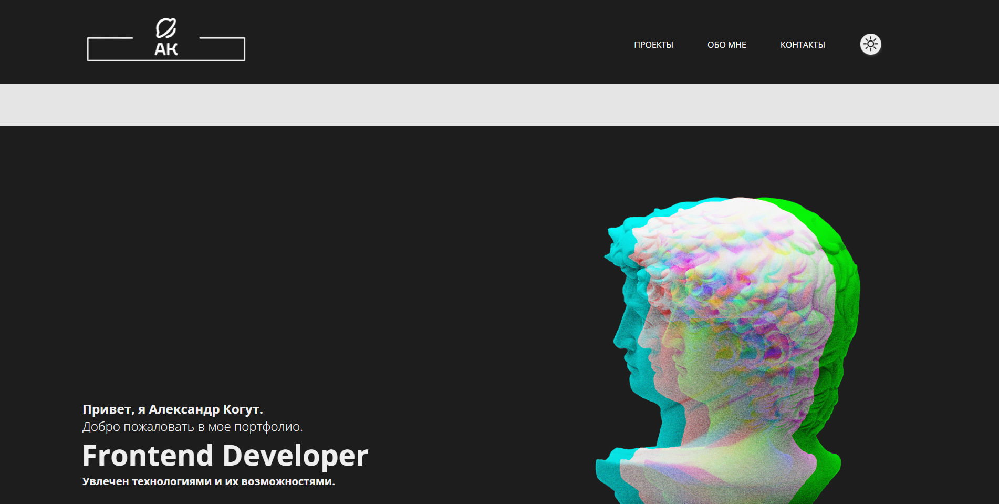
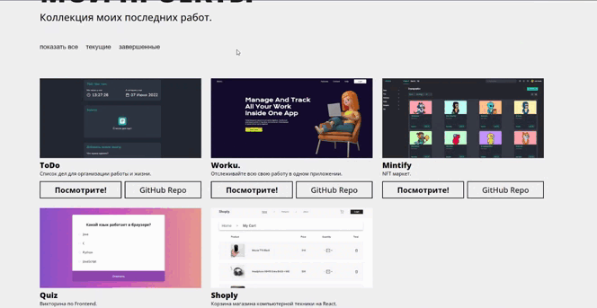

<h1 align="center">Portfolio</h1>

<h2 align="center"><a  href="https://bund322.github.io/portfolio/" target = "_blank">Live Demo</a></h2>

## Описание

Портфолио, реализованное с нуля на html + css + JS. Содержит 4 раздела информации (Приветствие, мои проекты, обо мне и контакты соответственно).
Я сам изучал веб-разработку без каких-либо курсов или тренингов, поэтому не ожидайте слишком многого от исходного кода xD.

## О проекте

- Реализованы 2 темы интерфейса (светлая и темная) с помощью функций JavaScript.

- Стиль страницы сверстан с помощью CSS, CSS flexbox, CSS Grid.
- Сортировка проектов реализована через библиотеку JQuery.

- Использован шрифт OpenSans с Google Fonts.
- Сайт адаптирован для мобильных устройств.

## Развитие

Это портфолио будет развиваться с каждым новым проектом.

### Спасибо за внимание

